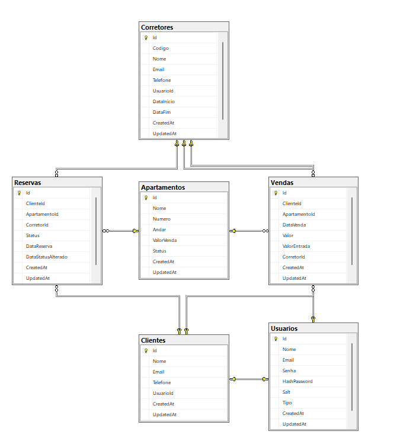

# 🏢 Direcional - Teste Técnico

Sistema desenvolvido para o processo seletivo da vaga de Analista / Desenvolvedor Sênior no Grupo Direcional.  
A aplicação consiste em uma API RESTful desenvolvida em .NET 9 para gerenciar clientes, apartamentos, vendas e reservas.

---

## 📌 Tecnologias Utilizadas

- [.NET 9](https://dotnet.microsoft.com/en-us/)
- [Entity Framework Core](https://learn.microsoft.com/en-us/ef/)
- [SQL Server Express (Docker)](https://hub.docker.com/_/microsoft-mssql-server)
- [JWT Authentication](https://jwt.io/)
- [Docker](https://www.docker.com/)
- [Docker Compose](https://docs.docker.com/compose/)
- [Swagger (OpenAPI)](https://swagger.io/)

---

## 🚀 Como Executar o Projeto

1. **Clone o repositório**

```bash
git clone git@github.com:paulovzp/Direcional.git
```
```bash
cd direcional
```

2. **Execute com Docker Compose para criar apenas o banco**

```bash
docker-compose up -d sqlserver
```

3. **Execute o migration**

```bash
cd src/Direcional.Persistence
```
```bash
dotnet ef database update --project Direcional.Persistence.csproj
```

4. **Execute a API**
```bash
cd src/Direcional.Api
```
```bash
dotnet run
```

## 🚀 Testar o Projeto

1. **Acesse a API via Swagger**
```bash
http://localhost:44330/swagger
```

2. **Criar um corretor**
```bash
post	/api/corretor
{
  "email": "corretor@direcional.com.br",
  "telefone": "+55 38 999997788",
  "nome": "Corretor Direcional"
}
```


## 📝 Considerações e Decisões Técnicas

🏗️ Arquitetura e Estrutura do Projeto

	Decisão: Clean Architecture
		•	Estrutura em Camadas: O projeto segue os princípios da Clean Architecture com separação clara de responsabilidades:
		•	Direcional.Api: Camada de apresentação (Controllers/Endpoints)
		•	Direcional.Application: Camada de aplicação (Services, DTOs, Interfaces)
		•	Direcional.Domain: Camada de domínio (Entidades, Regras de negócio, Services)
		•	Direcional.Persistence: Camada de infraestrutura (Repositórios, Context)
		•	Direcional.Infrastructure: Camada de infraestrutura compartilhada
	Justificativa
		•	Facilita manutenibilidade e testabilidade
		•	Permite evolução independente das camadas
		•	Segue princípios SOLID
		•	Reduz acoplamento entre componentes

📊 Banco de Dados
	
	Modelagem
		•	Padrão: Domain-Driven Design (DDD)
		•	Entidades Principais: Cliente, Corretor, Apartamento, Venda, Reserva
		•	Relacionamentos: Definidos com FK constraints
		•	Auditoria: Campos CreatedAt e UpdatedAt em todas as entidades



🔧 Padrões de Desenvolvimento

	Repository Pattern
		•	Implementação: Generic repository com serviços específicos
		•	Benefícios: Abstração da camada de dados, facilita testes unitários
	Service Layer Pattern
		•	Implementação: Serviços de domínio e aplicação separados
		•	Exemplo: VendaService para regras específicas de vendas
		•	Benefícios: Concentração da lógica de negócio
	Validation Pattern
		•	Implementação: FluentValidation com rule sets
		•	Regras: CreateRule, UpdateRule, DeleteRule
		•	Benefícios: Validações centralizadas e reutilizáveis

🔄 Padrões de Negócio

	Domain Services
		•	Exemplo: VendaService.Efetuar() para processar vendas
		•	Regras: Validação de valor de entrada, mudança de status do apartamento
		•	Benefícios: Encapsulamento de regras complexas de negócio
	Status Management
		•	Apartamentos: Disponível → Reservado → Vendido
		•	Controle: Através de enums e validações no domínio

🧪 Estratégia de Testes

	Recomendações
		1.	Testes Unitários: Para domain services e validators
		2.	Testes de Integração: Para repositories e database
		3.	Testes de API: Para endpoints usando TestServer
		4.	Mocking: Para dependências externas

📋 Considerações para Evolução

	Melhorias Futuras
		1.	Caching: Implementar Redis para dados frequentemente acessados
		2.	Logging: Structured logging com Serilog
		3.	Monitoring: Health checks e métricas
		4.	CQRS: Para separação de comandos e consultas complexas
	Escalabilidade
		1.	Load Balancing: Preparado para múltiplas instâncias
		2.	Database Sharding: Para crescimento de dados
		3.	Microservices: Divisão por bounded contexts